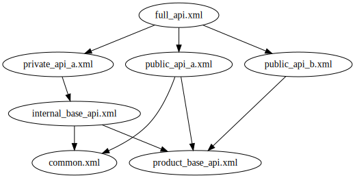

# Mavlib Gen

 

A mavlink generator with a permissive MIT license. This project is for a MAVLink generator ONLY.
No additional features or tools will be included in this project.

## Language Support

Language | Generator Status
---------|-----------------
C        | 40%
Python   | 0%

## Features

- [Capable of generation based on complex include trees](#complex-include-trees)
- [Simple, lean helper methods within generated code](#simple-lean-helper-methods)
- [Thorough unit tests](#thorough-unit-tests)
- [Versioned releases](#versioned-releases)

### Complex Include Trees

One feature I've wanted in pymavlink for quite some time is the ability to generate
mavlink code from more advanced include trees, such as the one below.

Such support allows developers to better separate/isolate specific modules of a
messaging system. Thus avoiding large, hard to navigate definition files.

### Simple, lean helper methods

*Stuff about parsing based on char arrays instead of single character*

### Thorough unit tests

Thorough tests on both the generator and the generated code mean user can have assurances the
library will work as expected with every update

### Versioned releases

Proper release versioning means compatibility can break between major versions. This becomes
increasingly important as the project ages to help keep code uncluttered and readable.
